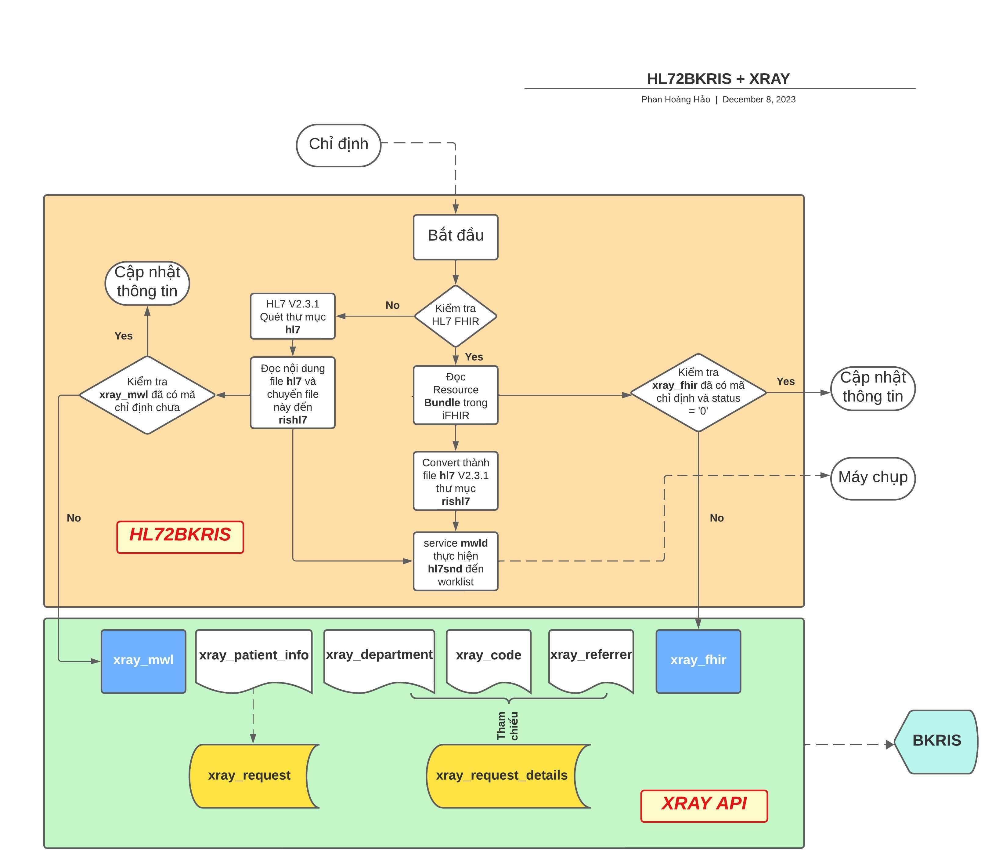
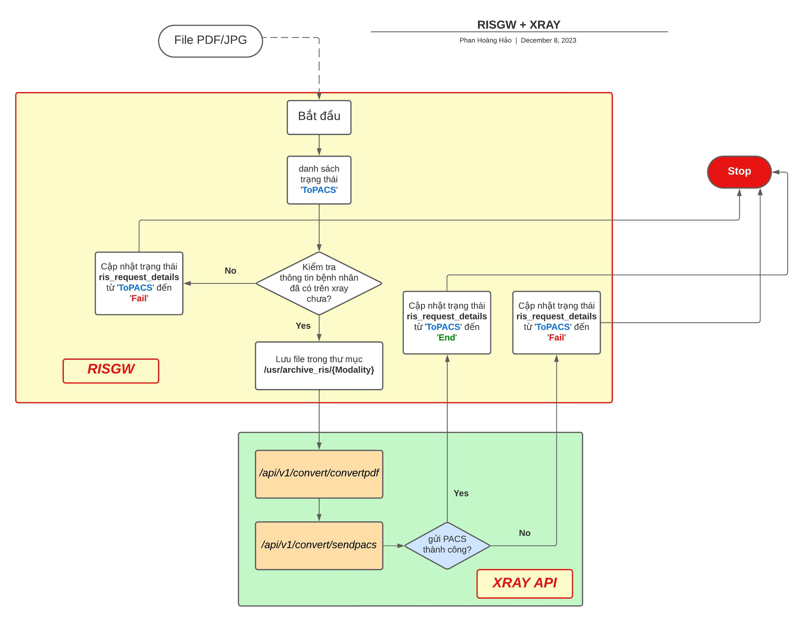
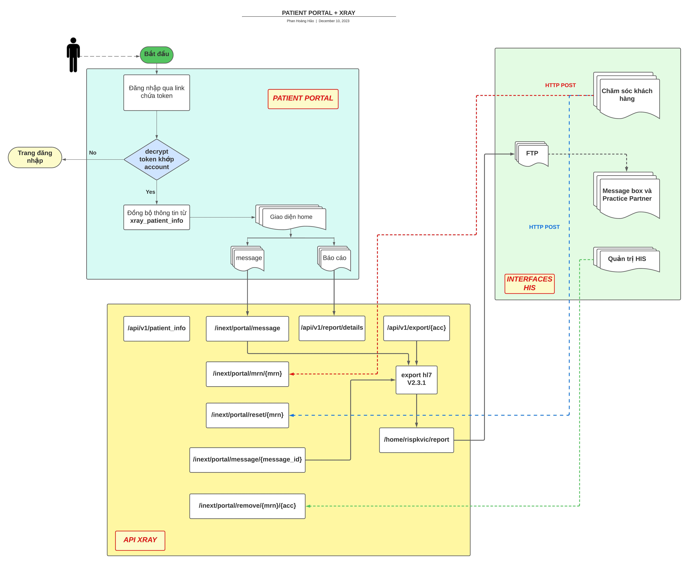
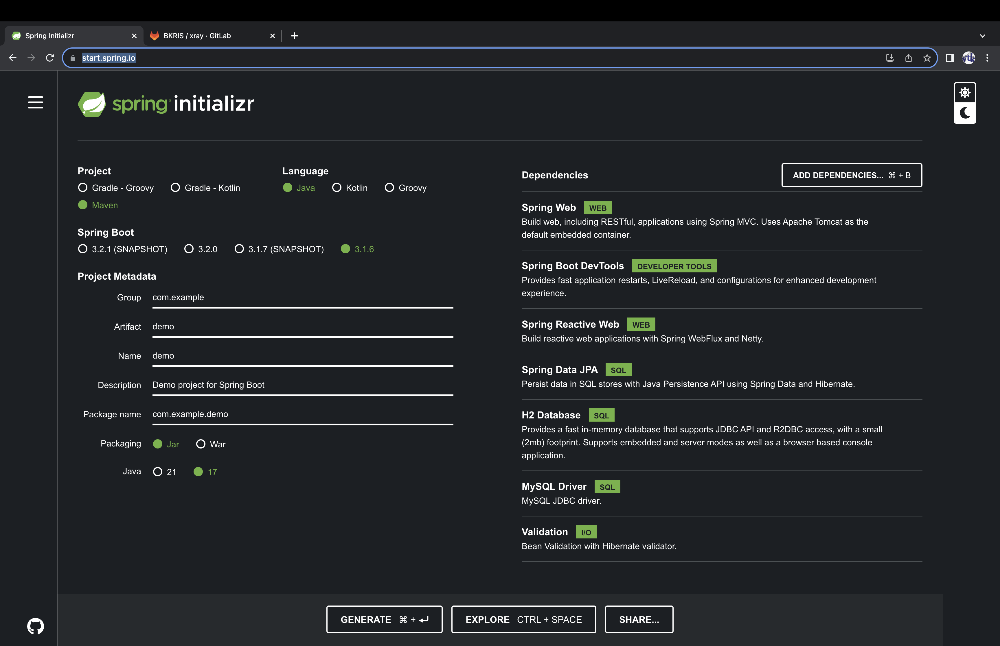
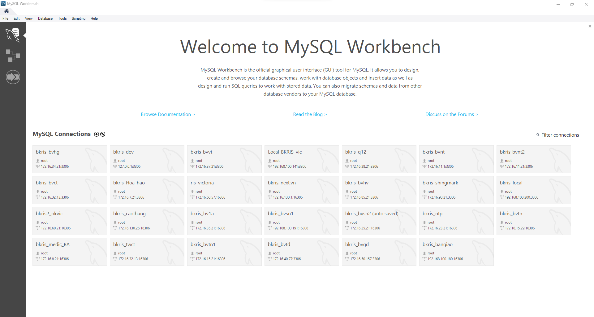
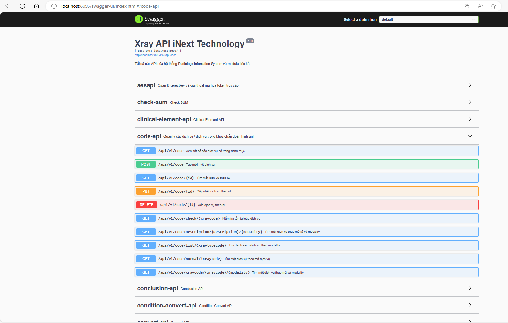

# xray

API xray là api cho toàn bộ ứng dụng BKRIS về quản lý thông tin chỉ định và report chẩn đoán hình ảnh.

## Kết nối `hl72bkris` và `xray` 

   

## Kết nối `risgw` và `xray`

   

## Kết nối `Portal` và `xray`

   

## Bắt đầu

API được phát triển trên framework Springboot + JPA + Mysql + Tools HL7V2.3.1 và FHIR R4.

Khi bắt đầu một dự án mới với Springboot có thê vào Tạo mới 1 dự án Springboot Maven JPA:https://start.spring.io



Sử dụng Eclipse hoặc IntelliJ IDEA làm IDE phát triển code.


* [Java Platform (JDK) 8 hoặc cao hơn](http://www.oracle.com/technetwork/java/javase/downloads/index.html)
* [Apache Maven 3.x](http://maven.apache.org/)
## Thêm các resource

- [ ] [Tạo](https://docs.gitlab.com/ee/user/project/repository/web_editor.html#create-a-file) or [upload](https://docs.gitlab.com/ee/user/project/repository/web_editor.html#upload-a-file) files
- [ ] [Thêm tệp hoặc cập nhật](https://docs.gitlab.com/ee/gitlab-basics/add-file.html#add-a-file-using-the-command-line) or push an existing Git repository with the following command:

```
cd existing_repo
git remote add origin https://gitlab.inext.vn/bkris/xray.git
git branch -M main
git push -uf origin main
```

## Dùng tools Mysql Workbench để sử dụng khi có yêu cầu chỉnh sửa



## Khởi động nhanh

1. Import project tới Maven as Project với Eclipse hoặc open với IntelliJ IDEA
2. Tìm `XrayApplication.java` từ SideBar, chuột phải vào, select `Run As` > `Java Application` với Eclipse hoặc đơn giản hơn với button màu xanh lá cây góc phải màn hình của IntellJ IDEA.
3. Truy cập [http://localhost:8093/api/v1/user](http://localhost:8093/api/v1/user)

## Cấu hình Datasource

1. Thông tin cấu hình chi tiết `src` > `main` > `resources` > `application.properties`
2. Bình thường địa chỉ kết nối mysql database là `127.0.0.1` tuy nhiên riêng ở PK Victoria là `172.16.100.4` server RIS-BK (dùng để phân tải)
3. Lưu ý quan trọng: `spring.jpa.hibernate.ddl-auto=none` không được chỉnh sửa hoặc thiếu trong file cấu hình.
4. Lưu ý: Thông số `user`, `password`, `port` và `schema` không thay đổi.

## Cấu hình thông số server HAPI - iFHIR

1. Thông tin cấu hình chi tiết `src` > `main` > `java` > `ris` > `order` > `xray` > `hapi` > `convert` > `FHIRtype` sau đó đổi thông số phù hợp với IP của server này được cài mà xray có thể kết nối được (mặc định `127.0.0.1`).
2. Tài khoản mặc định là `admin\admin@fhir123`

## Các service Reactive để kéo các API khác trong hệ thống về xray

1. File cấu hình WebClient `src` > `main` > `java` > `ris` > `order` > `xray` > `localService` > `WebClientConfig` trong đó có 3 `@Bean` tới `localApiClient` - api xray, `hapiApiClient` - api hapi, `portalApiClient` - api portal (vì HIS không thể can thiệp trực tiếp với portal được nên cần thông qua API xray)
2. Đi kèm với các kết nối này là 3 service đi kèm `WebServiceXray`, `WebServiceHapi` và `WebServicePortal`

## Convert nonDICOM

Tất cả API để `BKRIS` và `RISGW` kết nối dùng để convert nonDICOM đến DICOM đều ở package `src` > `main` > `java` > `ris` > `order` > `xray` > `convertDICOM`

## Export Report HL7V2 và Message HL7 V2 (PK Victoria)

Tất cả trao đổi trích xuất báo cáo và dạng message HL7 V2 đồng bộ qua FTP được chứa trong package `src` > `main` > `java` > `ris` > `order` > `xray` > `export`

## Test API và document với Swagger2

* Xem mô tả và test api với swagger2 truy cập có thể thay đổi ip phù hợp với server deploy [http://localhost:8093/swagger-ui/index.html](http://localhost:8093/swagger-ui/index.html)



## Build và chạy triển khai

1. Với Test
    * `mvn clean install`
2. Không Test
   * `mvn clean install -DskipTests=true`
3. run
   * `java -jar xray-1.0.0.jar`
